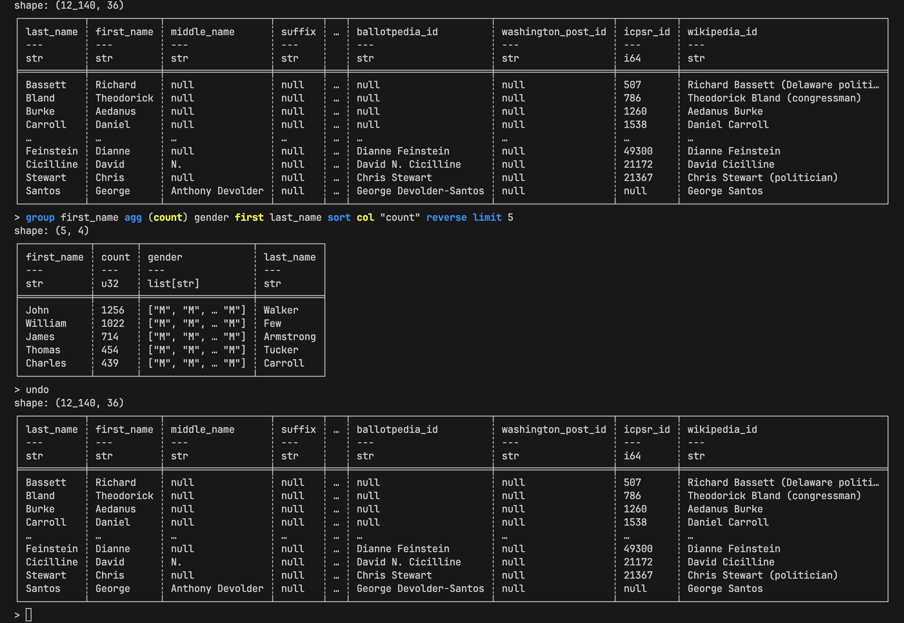

# `sql-repl`



## REPL

- `exit`/`quit`: exit the REPL loop.
  ```py
  exit
  ```
- `undo`: undo the previous successful operation.
  ```py
  undo
  ```
- `reset`: reset all the changes and go back to the original data frame.
  ```py
  reset
  ```
- `schema`: show column names and types of the data frame.
  ```sql
  schema
  ```

## Statements

- `select`
  ```sql
  select last_name first_name
  ```
  - Select columns "last_name" and "first_name" and collect them into a data frame.
- Group by
  ```sql
  group first_name agg (count)
  ```
  - Group the data frame by column "first_name" and then aggregate each group with the count of the members.
- `filter`
  ```sql
  filter first_name = "John"
  ```
- `limit`
  ```sql
  limit 5
  ```
- `reverse`
  ```sql
  reverse
  ```
- `sort`
  ```sql
  sort icpsr_id
  ```

## Expressions

- `col`: reference to a column.
  ```sql
  select col first_name
  ```
- `exclude`: remove columns from the data frame.
  ```sql
  select exclude last_name first_name
  ```
- literal: literal values like `42`, `"John"`, `1.0`, and `null`.
- binary operations
  ```sql
  select a * b
  ```
  - Calculate the product of columns "a" and "b" and collect the result.
- unary operations
  ```sql
  select -a
  ```
- aggregate
  ```sql
  select sum a
  ```
  - Sum all values in column "a" and collect the scalar result.
- `alias`: assign a name to a column.
  ```sql
  select alias product a * b
  ```
  - Assign the name "product" to the product and collect the new column.
- conditional
  ```sql
  select if class = 0 then "A" if class = 1 then "B" else null
  ```
- `cast`: cast a column to either type `str`, `int`, or `float`.
  ```sql
  select cast str id
  ```
  - Cast the column "id" to type `str` and collect the result.
